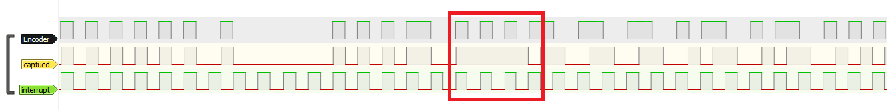
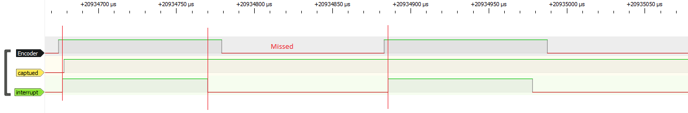
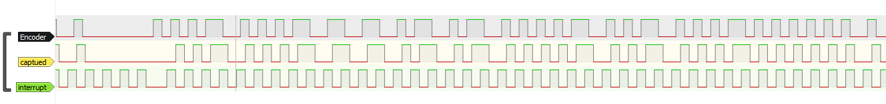
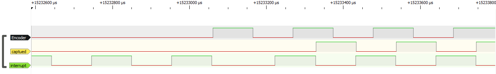

# Manchester Decoder Module

## Overview
This module provides functionality to receive and decode Manchester encoded data using an nRF52832 Feather microcontroller. It employs a state machine to handle the reception process and decode the received data.

## Usage
1. Include the `manchesterStateMachine.h` header file in your Arduino sketch.
2. Configure the input pin for receiving Manchester encoded data using `setInputPin()`.
3. Optionally, use `setOutputSerial()` to activate serial output for decoded data and error prompts.
4. Optionally, configure the output pin for decoded data using `setOutputPin()`.
5. Set up the timer interrupt with `setupManchesterTimerIRQ()`.
6. Use the Manchester state machine using `manchesterStateMachine()`.

**Note**: If using pins 6 and 8 for input and output, respectively, the user won't be able to use the serial port.
**Note**: Use the `SYNC` define in the `manchesterStateMachine.h` header file matches. This define affects the behavior of the timer interrupt and is crucial for accurate decoding.

## Example
```c
#include "manchesterStateMachine.h"

#define INPUT_PIN 6
#define OUTPUT_PIN 8

void setup() {
  setInputPin(INPUT_PIN);
  setOutputPin(OUTPUT_PIN);
  setupManchesterTimerIRQ(); 
}

void loop() {
  manchesterStateMachine();
}
```

## Behavior Comparison

Here are the comparison images showing the behavior difference when using `SYNC` as true and false:

### `SYNC` = false


**Description:** This image shows the interrupt missing the actual data due to timing issues, leading to decoding errors.

### `SYNC` = true


**Description:** This image demonstrates the interrupt catching the middle of the data transmission, ensuring accurate decoding.
